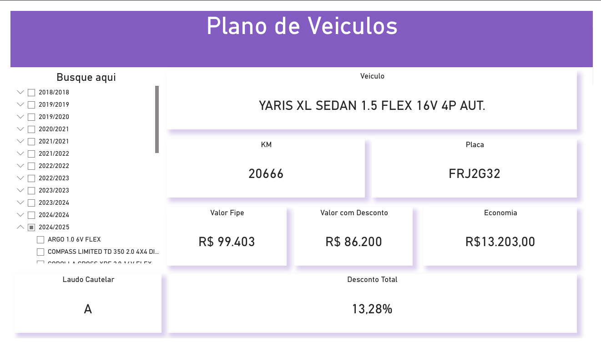

🚗 Automotive Data Analytics - Dashboard Plano de Veículos

Este projeto consiste em uma solução de Business Intelligence desenvolvida para otimizar a análise de frotas e a tomada de decisão em negociações automotivas. O dashboard transforma dados brutos em insights estratégicos sobre valor de mercado (FIPE), depreciação e margens de economia.

🚀 Tecnologias e Competências
Power BI: Modelagem de dados e visualização.

DAX (Data Analysis Expressions): Criação de medidas para cálculo de economia real e indicadores percentuais.

Power Query (M): Processamento de dados e ETL para limpeza e padronização de placas e modelos.

Data Modeling: Estruturação de filtros hierárquicos por ano e modelo.

📊 Funcionalidades Técnicas
Análise de Margem: Cálculo dinâmico de Desconto Total (%) e Economia Nominal (R$) em relação à tabela FIPE.

Data Cleaning: Tratamento de strings para exibição padronizada de modelos e anos.

Filtros Dinâmicos: Navegação intuitiva (User Experience) para busca rápida por placa ou categoria de veículo.

Integridade de Dados: Validação de laudos cautelares integrada à visualização principal.

📈 Impacto de Negócio
A ferramenta permite que o time comercial ou de suprimentos realize uma Análise Preditiva de custos e identifique as melhores oportunidades de compra baseadas em KPIs de desconto e estado de conservação (Laudo), reduzindo o tempo de consulta manual e erros de cálculo em 100%.
